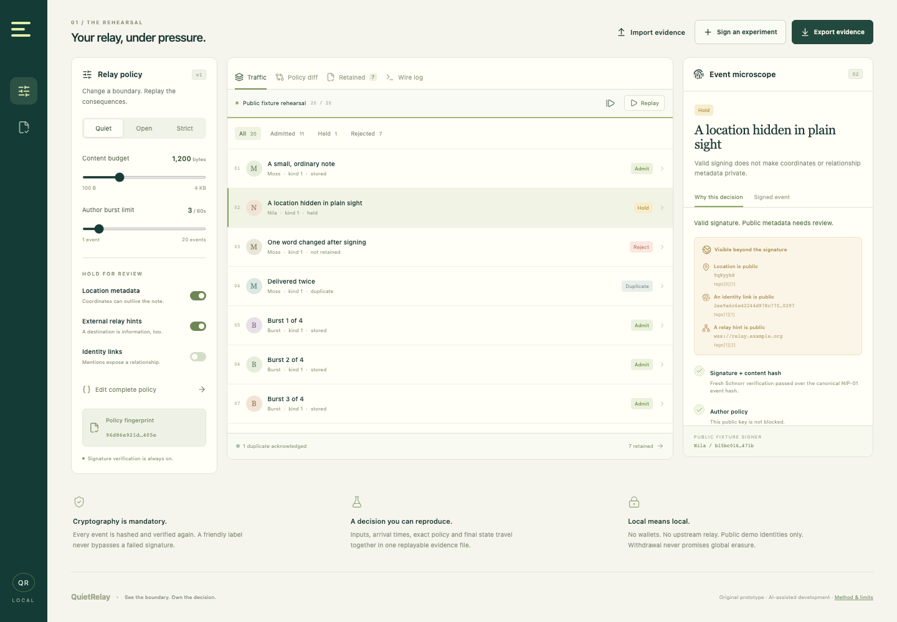
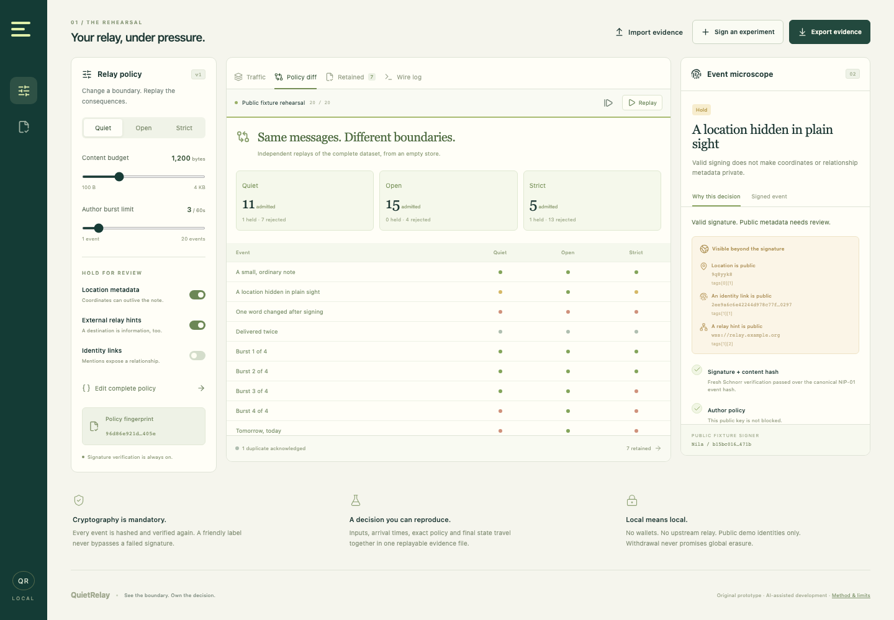
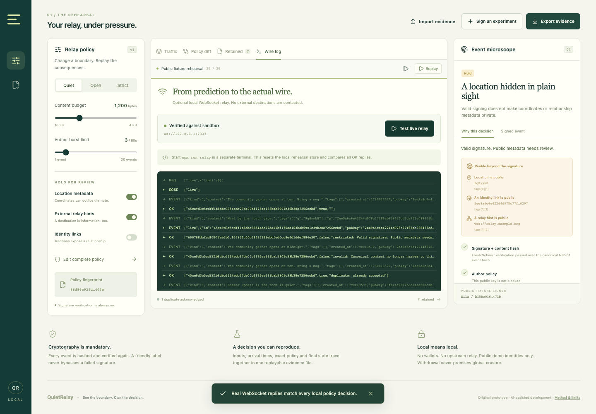

# QuietRelay

**Understand what gets through.** A local Nostr policy workbench that makes relay decisions visible, reproducible and testable against a real WebSocket server.

**[Demo video (3:33)](https://youtu.be/D7HTGdRcIfg)** · 3:33 end-to-end walkthrough of the actual UI, loopback relay and CLI verification. English captions and chapters in [media/](media/YOUTUBE.md).



A correctly signed event can still reveal a location, exceed a budget or try to withdraw somebody else's note. QuietRelay lets a relay operator experiment with those boundaries before changing a live service.

This is an original, AI-assisted prototype prepared for the BOSS Battle Nostr / freedom-stack opportunity. Event eligibility, application and submission are separate; this repository does not claim acceptance or an award. Development began September21,2026. The complete original commit history is being published on the same day after local code/package review; no earlier public-push history is claimed.

## Demo and build status

The 3:33 demo film (linked above) was recorded on September22 from the running app with Playwright, including the real loopback relay exchange and real terminal commands; narration is an ElevenLabs stock synthetic voice. The organizer confirmed solo/global eligibility and disclosed AI assistance by email on September21. Submitted to BOSS Battle on Devfolio (Freedom Stack track) on September22: https://devfolio.co/projects/quietrelay-5f23

Day1 progress: original policy/protocol implementation, fixture signing, actual loopback server,21 passing tests and reproducible evidence packages. No prior weekly progress logs are claimed.

Day2 progress (September22): real-browser QA at 1440×1000 and 390×844 including the live relay flow, fixes for swapped Open/Quiet columns in the policy diff and an evidence import that was hidden on phones, three screenshots and the demo film.

## Run

Node.js **22.12+** (tested with 26.7). No API keys, wallets or inference service.

```sh
npm ci
npm run dev
```

Open **http://127.0.0.1:4326/**. The complete policy sandbox works in the browser. To exercise the real loopback relay, run this in another terminal:

```sh
npm run relay
```

Then select **Wire log → Test live relay**. The app connects only to `ws://127.0.0.1:7337/`, sends actual Nostr frames, compares every `OK` reply with its local prediction, and retrieves the resulting store. No upstream relay is contacted. The fixed clock is explicitly a synthetic rehearsal clock; it is not a production server clock.

## The useful loop

1. Inspect the location-bearing note: authentic signature, public location and relationship metadata, quarantined under Quiet policy.
2. Change to Open and compare the same signed traffic across all three presets. No content is rewritten to achieve the outcome.
3. Sign an original experiment using one of eight **disposable public fixture identities**. Add metadata or deliberately change content after signing. Watch the actual integrity check fail.
4. Inspect replacements, live-only ephemeral events and author-scoped deletion requests. Retained events show what a new subscriber can retrieve.
5. Export evidence; re-import to check the digest and independently rerun the policy reducer. Edit a claimed result and verification fails, even if the file digest is recomputed.

The 20-record Quiet rehearsal produces **11 admitted, 1 held, 7 rejected and 1 duplicate**, with **7 retained records**. “Admitted” includes ephemeral delivery, replacements and deletion requests; it does not mean 11 retained notes.

## Verify

```sh
npm test
npm run build
npm run replay
npm run verify -- artifacts/quiet-relay-evidence.json
```

21 tests pass locally: the 19 official BIP-340 verification vectors, independent Node SHA-256 serialization checks, `nostr-tools` interoperability, tampering/cached-validity bypass, byte/time/rate boundaries, duplicate behavior, replacement ties, deletion authority/tombstones, filters, evidence forgery and a real two-client WebSocket exchange. Tests include malformed requests, origin restrictions and oversized-frame rejection. See [validation](docs/VALIDATION.md).

`npm run package` produces a source ZIP from the exact clean Git commit and a compiled browser ZIP in `artifacts/`, with SHA-256 checksums. The browser ZIP contains the sandbox; the optional loopback server runs from the source package.

## Architecture

| Layer                   | What actually runs                                                                          |
| ----------------------- | ------------------------------------------------------------------------------------------- |
| `src/core/protocol.ts`  | Fresh canonical NIP-01 hashing, BIP-340 verification, fixture signing and filter evaluation |
| `src/core/policy.ts`    | Explicit policy checks, accepted-event arrival budgets and local retention state            |
| `src/core/replay.ts`    | Deterministic replay, ordered-key evidence digest and recomputation verifier                |
| `server/relay.ts`       | Loopback-only WebSocket relay: `EVENT`, `REQ`, `CLOSE`; live and stored delivery            |
| `src/core/transport.ts` | Actual browser wire exchange and captured transport evidence                                |
| `src/main.tsx`          | Interactive policy editor, comparison, event composer, microscope and imports/exports       |

The workbench and server share the reducer so the wire test can expose transport/integration differences. Core correctness is checked separately against protocol vectors, independent hashing and explicit behavioral expectations. This is not two independent implementations of every rule.

## Scope and limits

- **Fixture identities are public test identities.** Their signing seeds are deliberately reproducible. Never use them as accounts, for custody, or for an identity claim. There is no private-key input UI. Exports contain wire fields, not signing keys. The vendored BIP-340 fixture retains only public verification fields.
- **Quarantine is an application policy.** Held messages receive a negative `OK` with a reason and are absent from the relay store. They remain in the local workbench's input evidence. Adjusting policy replays a new empty rehearsal; it does not silently publish held events.
- **Withdrawal is local.** NIP-09 requests remove eligible retained records and retain tombstones. Original inputs remain in the workbench/evidence. Other relays and readers can retain copies. This is not secure deletion or global erasure.
- **Metadata checks are explicit tag checks.** They do not detect all personal information or analyze encrypted content. Do not treat an admitted event as private or universally safe.
- **Local rehearsal, bounded memory.** Maximum 500 input records, 64 KiB wire events/frames, 8 connections, 16 subscriptions/connection, and 2 MB UI imports. No persistent relay database, authentication, durable abuse prevention or federation. Browser workbench state persists in local storage.
- **Supported protocol subset.** NIP-01 wire flow/filters, replacement/addressable conventions and scoped NIP-09 deletion. No claim of full NIP coverage or validation of every kind's application semantics. Unknown filter fields are rejected. The `/lab/reset` HTTP endpoint is separate local test infrastructure, not a Nostr extension.
- **Evidence is self-verifiable, not externally attested.** A digest identifies file content; anyone can create another internally consistent evidence file. Replay checks the claimed decisions, not who conducted the experiment.

Primary specification links, dependency versions and protocol decisions are in [PROTOCOL.md](docs/PROTOCOL.md). The film plan and how the recorded film follows it are in [DEMO.md](docs/DEMO.md).

| Policy diff: same signed inputs, three presets | Actual loopback exchange, verified against the sandbox      |
| ---------------------------------------------- | ----------------------------------------------------------- |
|        |  |

## Authorship and license

Original QuietRelay implementation created in September 2026 with substantial AI coding assistance and human-directed project goals. No runtime inference API. No code or data copied from YC Palinode or other campaign projects. React, Vite, Lucide, noble and ws are third-party dependencies credited in [ATTRIBUTION.md](docs/ATTRIBUTION.md). MIT license; see [LICENSE](LICENSE).
